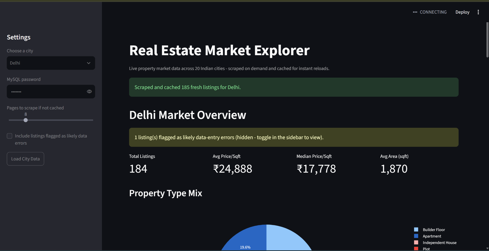
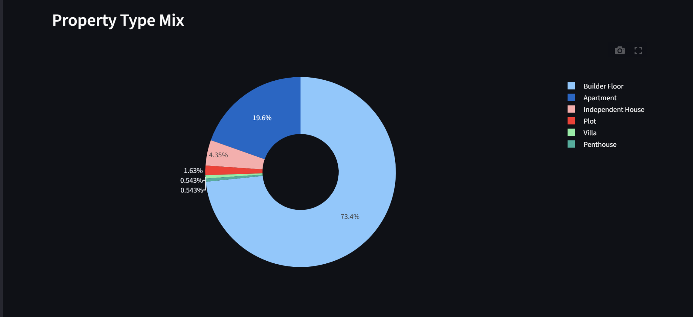
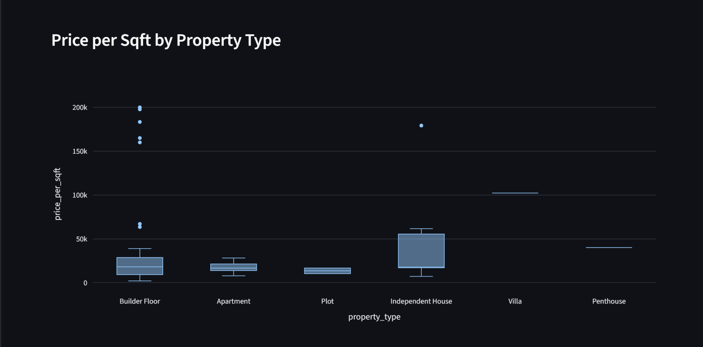
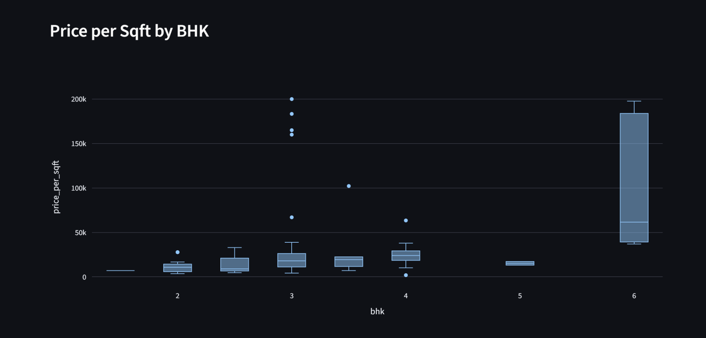
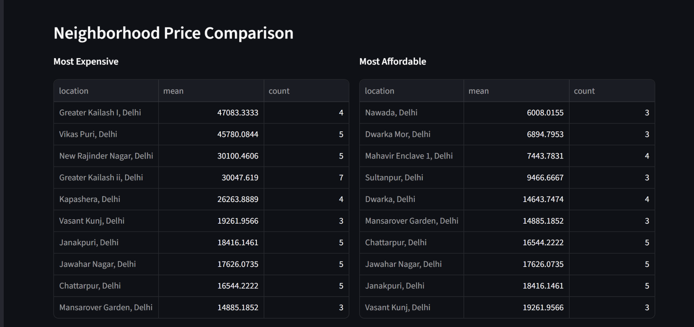
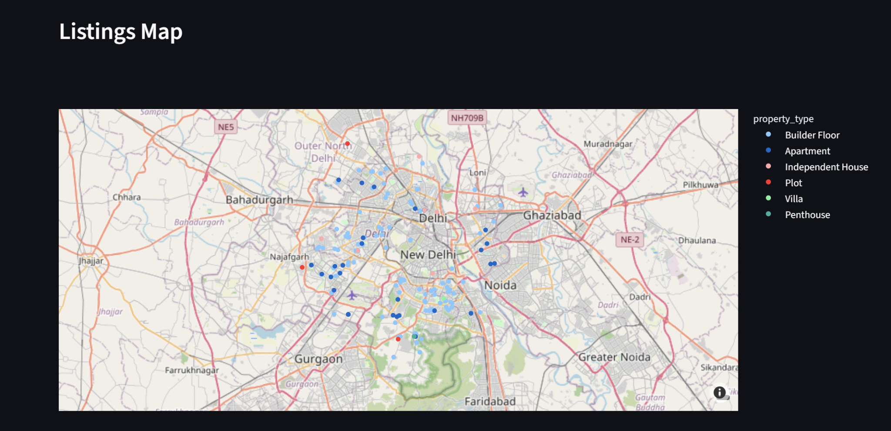

# 🏠 Real Estate Market Explorer

An end-to-end real estate market analytics application for exploring property listings across **20 Indian cities**. The project combines web scraping, data cleaning, MySQL storage, interactive Streamlit analytics, geospatial visualization, and Power BI reporting into a single workflow.

The application addresses a practical problem: **real-estate listing data is fragmented, inconsistent, and difficult to compare across locations.** This project creates a reusable pipeline for collecting listings, cleaning them, identifying suspicious records, storing structured data, and turning them into actionable market insights.

---

## 📌 Project Overview

Real Estate Market Explorer allows users to:

- Select a city from 20 supported Indian cities.
- Scrape property listings on demand when fresh data is required.
- Cache collected data so repeated analysis does not require unnecessary scraping.
- Store structured listings in MySQL.
- Clean inconsistent and missing values before analysis.
- Detect listings that may contain suspicious or erroneous values.
- Compare average and median price per square foot.
- Analyze the distribution of property types.
- Compare price-per-square-foot distributions across property types.
- Analyze price-per-square-foot across BHK categories.
- Identify relatively expensive and affordable neighborhoods.
- Visualize listings geographically on an interactive map.
- Explore processed data through an interactive Streamlit dashboard.
- Use Power BI for additional reporting and visualization.

---

## 🎯 Problem Statement

Real-estate listing platforms contain large amounts of useful information, but raw listing data is often difficult to analyze directly.

Common problems include:

- Inconsistent price and area formats
- Missing values
- Different property-type labels
- Location names with inconsistent formatting
- Potentially incorrect price or area entries
- Data spread across different cities and listings
- Repeated scraping of information that has already been collected

The goal of this project is to build a data pipeline and analytics layer that transforms raw property listings into a structured dataset that can be explored and compared efficiently.

---

## 💡 Solution

The project follows an end-to-end pipeline:

```text
Property Listing Sources
        ↓
Web Scraping
        ↓
Raw Listing Data
        ↓
Data Cleaning & Normalization
        ↓
Data Quality / Error Checks
        ↓
MySQL Database
        ↓
Streamlit Analytics Dashboard
        ↓
Interactive Charts + Map
        ↓
Market Insights
```

A caching mechanism is also used so that previously collected city data can be reused instead of unnecessarily scraping the same data again.

---

## ✨ Key Features

### 🌆 Multi-City Market Exploration

The application supports real-estate exploration across **20 Indian cities**. Users can select a city and load the corresponding dataset.

### 🕷️ On-Demand Web Scraping

If suitable cached data is not available, the application can trigger scraping for the selected city. This makes the dashboard more than a static visualization: it acts as an interface over the data collection and analysis pipeline.

### ⚡ Data Caching

Previously collected city data is cached and reused for subsequent requests. This reduces unnecessary scraping and improves reload performance.

### 🧹 Data Cleaning

The project handles common issues in scraped real-estate data, including:

- Missing values
- Numeric conversion
- Price normalization
- Area normalization
- BHK values
- Property-type normalization
- Price-per-square-foot calculation
- Location fields

### 🔎 Data Quality Checks

Potentially suspicious records are flagged as likely data-entry errors. Users can choose whether to include these records in the analysis.

### 💰 Market KPIs

The dashboard provides:

- Total listings
- Average price per square foot
- Median price per square foot
- Average property area

### 🏢 Property Type Analysis

The dashboard compares property categories such as:

- Builder Floor
- Apartment
- Independent House
- Plot
- Villa
- Penthouse

### 🛏️ BHK Analysis

Price-per-square-foot distributions can be explored across different BHK categories to identify differences in pricing patterns.

### 📍 Neighborhood Comparison

The application identifies neighborhoods with comparatively higher and lower average price-per-square-foot values.

### 🗺️ Geospatial Visualization

Listings containing usable geographic coordinates are displayed on an interactive map, allowing users to understand the spatial distribution of properties.

### 📊 Power BI Reporting

A separate Power BI dashboard is included for additional business-oriented analysis and reporting.

---

# 📸 Application Screenshots

The screenshots are ordered from the high-level dashboard to deeper market analysis.

## 1. Main Dashboard

The main dashboard provides the overall market view for the selected city. It combines city selection, data loading, scraping status, data-quality alerts, market KPIs, and the beginning of the visual analytics section.



---

## 2. Property Type Mix

This visualization shows the composition of the selected city's listings by property type. It helps identify which categories make up the largest share of the collected market sample.



---

## 3. Price per Sqft by Property Type

This box-plot visualization compares price-per-square-foot distributions across property types. It highlights differences in typical pricing, spread, and potential outliers between categories.



---

## 4. Price per Sqft by BHK

This visualization examines how price per square foot varies across BHK categories. The distributions make it possible to compare typical values and identify unusually high or low observations.



---

## 5. Neighborhood Price Comparison

This section compares neighborhoods based on their average price per square foot and listing count. It presents relatively expensive and affordable locations side by side for easier market comparison.



---

## 6. Listings Map

The interactive map plots available listings using their geographic coordinates and distinguishes them by property type. This provides a spatial view of where different types of properties are concentrated.



---

# 🏗️ Project Architecture

The project is organized into separate components for scraping, analysis, storage, and visualization.

```text
Real_Estate_Market_Analysis/
│
├── dashboards/
│   └── Analysis_Dashboard.pbix
│
├── data/
│   └── raw/
│       └── load_to_mysql.py
│
├── notebooks/
│   └── eda_cleaning.ipynb
│
├── scraper/
│   ├── scrape_listings.py
│   └── verify_cities.py
│
├── streamlit_app/
│   ├── app.py
│   ├── data_cleaning.py
│   ├── db_utils.py
│   └── requirements.txt
│
└── .gitignore
```

---

# 🔄 Data Pipeline

## 1. Data Collection

The scraper collects property listing information for the selected city.

Typical fields include:

- Property ID
- City
- Price
- Area
- BHK
- Location
- Property type
- Price per square foot
- Latitude
- Longitude
- Listing URL
- Scrape date

## 2. Cleaning

The raw data is passed through cleaning and normalization logic.

For example:

```text
Raw price
₹ 1.25 Cr
      ↓
Normalized numeric value
12500000
```

and:

```text
Raw area
1,850 sqft
      ↓
Normalized area
1850
```

Missing or invalid values are handled before database insertion and analysis.

## 3. Data Quality

The pipeline identifies records that may represent data-entry errors or unusually inconsistent observations.

These records can be hidden from the primary analysis while still remaining available for inspection.

## 4. Database Storage

Cleaned records are stored in MySQL, allowing the application to retrieve city-specific data efficiently.

## 5. Visualization

The processed data is used to generate:

- KPI cards
- Distribution charts
- Box plots
- Neighborhood comparisons
- Geospatial maps

---

# 🧰 Technology Stack

| Component | Technology |
|---|---|
| Programming Language | Python |
| Dashboard | Streamlit |
| Database | MySQL |
| Data Processing | Pandas |
| Visualization | Plotly |
| Geospatial Visualization | Interactive map visualization |
| Web Scraping | Python scraping tools |
| Business Intelligence | Power BI |
| Development Environment | VS Code |
| Version Control | Git & GitHub |

---

# 🗃️ Database

The application uses **MySQL** for persistent storage of cleaned property listings.

The database layer is responsible for:

- Creating the required database/table structure
- Establishing database connections
- Loading city data
- Checking whether city data is sufficiently fresh
- Inserting cleaned listings
- Retrieving listings for analysis

Database credentials are entered at runtime rather than stored directly in the source code.

---

# ⚙️ Local Setup

## Prerequisites

Make sure the following are installed:

- Python 3.9+
- MySQL Server
- Git
- A GitHub account

## 1. Clone the Repository

```bash
git clone https://github.com/Imranali2109/Real_Estate_Market_Analysis.git
cd Real_Estate_Market_Analysis
```

## 2. Create a Virtual Environment

### Windows

```bash
python -m venv venv
venv\Scripts\activate
```

### macOS / Linux

```bash
python3 -m venv venv
source venv/bin/activate
```

## 3. Install Dependencies

```bash
pip install -r streamlit_app/requirements.txt
```

## 4. Configure MySQL

Make sure your MySQL server is running.

Before starting the dashboard, verify:

- MySQL Server is running
- The configured MySQL username exists
- The user has permission to create/use the required database
- The password you enter belongs to that MySQL user

## 5. Run the Streamlit Application

From the project root:

```bash
streamlit run streamlit_app/app.py
```

Then open the local URL provided by Streamlit, usually:

```text
http://localhost:8501
```

---

# 🖥️ Using the Application

### Step 1 — Select a City

Choose a supported Indian city from the sidebar.

### Step 2 — Enter MySQL Password

Enter the password for the configured MySQL user. The password is requested at runtime and is not stored in the repository.

### Step 3 — Configure Scraping

If cached data is unavailable, choose the number of pages to scrape.

### Step 4 — Load City Data

Click **Load City Data**.

The application will:

```text
Check cache
    ↓
Use fresh cached data if available
    OR
Scrape new listings
    ↓
Clean data
    ↓
Validate records
    ↓
Store in MySQL
    ↓
Generate dashboard analytics
```

### Step 5 — Explore the Dashboard

Review the KPIs, property-type distribution, pricing distributions, neighborhood comparisons, and listings map.

---

# 📊 Example Questions the Dashboard Can Answer

- What is the average price per square foot?
- What is the median price per square foot?
- Which property type dominates the collected listings?
- How does pricing vary between property types?
- How does price per square foot vary by BHK?
- Which neighborhoods have the highest average prices?
- Which neighborhoods appear relatively affordable?
- Where are listings geographically concentrated?
- Which observations may require data-quality review?

---

# 🔐 Data & Security

Sensitive credentials should **never** be committed to GitHub.

The repository's `.gitignore` excludes environment files and the Python virtual environment.

The application requests the MySQL password at runtime rather than hardcoding it in the source code.

If the project is extended with API keys or other secrets, store them in environment variables or another secure secret-management mechanism instead of committing them to the repository.

---

# 🚀 Future Improvements

- Automated scheduled scraping
- Historical price tracking
- City-to-city price comparison
- Interactive budget, BHK, property-type, and area filters
- Neighborhood-level trend analysis
- Machine-learning based price prediction
- Automated anomaly detection
- User authentication
- Cloud deployment with a hosted database
- Automated tests for scraping and data cleaning
- Monitoring for scraper failures and stale data

---

# 📈 Potential Business Applications

The project can be extended from a visualization tool into a real-estate decision-support platform.

Potential users include:

- Property buyers
- Real-estate investors
- Brokers
- Developers
- Market researchers
- Property consultants

For example, an investor could compare neighborhood-level price-per-square-foot distributions and identify areas that appear relatively affordable compared with other locations in the same market.

---

# 👨‍💻 Author

**Imran Ali**

Real Estate Market Explorer — an end-to-end data engineering and analytics project combining web scraping, data cleaning, MySQL, interactive dashboards, geospatial analysis, and Power BI.

---

# ⭐ Project Highlights

```text
20 Indian Cities
       +
Web Scraping
       +
Data Cleaning
       +
Data Quality Checks
       +
MySQL Storage
       +
Caching
       +
Streamlit Dashboard
       +
Interactive Analytics
       +
Geospatial Visualization
       +
Power BI
```

The project demonstrates a complete workflow from **raw real-estate listing collection to interactive market analysis**.
